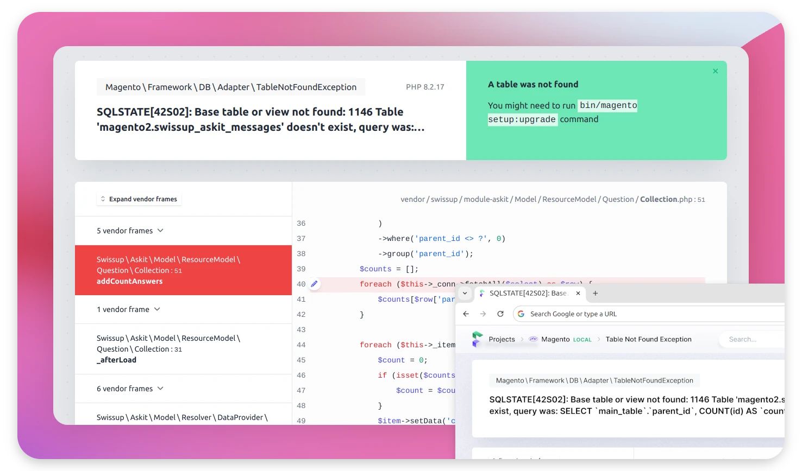

# Ignition for Magento 2

A beautiful error page and error tracking service for Magento
powered by [spatie/ignition](https://github.com/spatie/ignition).

<picture>
    <source media="(prefers-color-scheme: dark)" srcset="./media/dark.webp">
    
</picture>

## Installation

```bash
composer require swissup/module-ignition
bin/magento setup:upgrade --safe-mode=1
```
