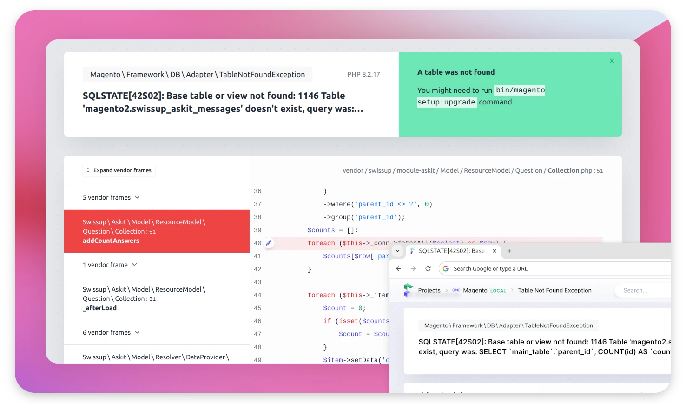

# Ignition for Magento2

A beautiful error page and error tracking service for Magento
powered by [spatie/ignition](https://github.com/spatie/ignition).

<picture>
    <source media="(prefers-color-scheme: dark)" srcset="./media/dark.webp">
    
</picture>

## Installation

```bash
composer require swissup/module-ignition
bin/magento module:enable Swissup_Ignition
```

## Using in developer mode

This module will show the error page with detailed information
about the error and stack trace only in developer mode:

```
bin/magento deploy:mode:set developer
```

## Using in production mode

You can also use it in production mode to log the errors using [Flare](https://flareapp.io/)
error tracking service. To do so, create flare project, get the "Project Key"
and run this command:

```
bin/magento config:set swissup_ignition/general/api_key [API_KEY]
bin/magento cache:clean
```

By default, only PHP errors are logged. If you would like to track JS
errors too, run this command:

```
bin/magento config:set swissup_ignition/general/enable_js_reporting 1
bin/magento cache:clean
```

## Docker

When using Ignition with Docker the `Open in Editor` links will show incorrect paths.
To fix this issue open `~/.ignition.json` file and add `remote_sites_path` and
`local_sites_path` settings.

**Example:**

```
{
    "remote_sites_path": "/var/www/public",
    "local_sites_path": "/Users/username/Sites/mysite/public"
}
```
